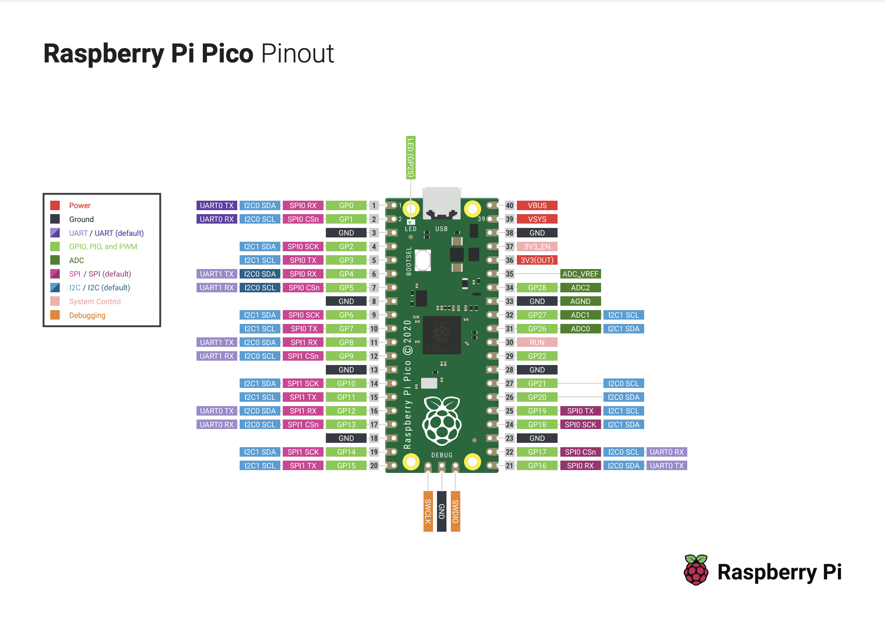

# Hey Jay

## Intro
[You will make the light sing](https://youtu.be/hkJqY9b0fkc). You’re going to assemble a Hey Jay, a little device that I like to think of as a reverse light organ. Once it’s assembled and powered up, you can wave your hand over the device and trigger the motion sensor. Then, the microcontroller takes a sample of the ambient light, maps the measurements onto a digital synthesizer, and finally it outputs the music to an ⅛” headphone jack. Think of it like a sort of digital wind chime that plays when you strum the light.

## What This Kit Includes
- 1x Raspberry Pi Pico H
- 1x Breadboard
- 2x 1k resistors (one for the build, one spare)
- 2x 0.1 100nF ceramic capacitors (one for the build, one spare)
- 1x APDS-9960 Light and Motion Sensor
- 1x TRRS Jack
- 1x Micro USB/USB C cable
- 1x Pair of Earbuds
- 1x  1/8" to 1/8" cable as alternative to headphones
- Jumper wire

## More on the Individual Components
### Raspberry Pi Pico pre-mounted on a breadboard

Raspberry Pi makes wonderful little computers for hobbyists. [The Pico is their microcontroller](https://www.raspberrypi.com/documentation/microcontrollers/raspberry-pi-pico.html), a small but powerful integrated circuit that has tons of open source support, projects, and help. It is the brains of our project, and where the software runs. It communicates with the two attached devices, the APDS-9960 and the TRRS Jack.

All the actual programming and software is done, so you’ll only need to worry about the assembly. But, knowing how the guts work is half the fun. The software only uses a few of the pins on the Pico for this project: power and ground pins to pull electricity through the circuit, the SDA and SCL pins to communicate with the APDS-9960, and a general purpose pin to output the audio.

[The Pico is already embedded in a breadboard](https://learn.sparkfun.com/tutorials/how-to-use-a-breadboard/all?gad_source=1&gclid=CjwKCAjwg8qzBhAoEiwAWagLrCOuPgeaCGzUKGcsefkz8sO2QxBlmTG8HAUSbq4eaGX5hsJnfJ0WjBoCZXoQAvD_BwE), a small development board that lets you easily assemble electronics without solder. The breadboard I’ve included is printed specially for the Pico, you’ll note that each row on the board is numbered/lettered to correspond to the pinout diagram.

### APDS-9960 Light and Motion Sensor
We’re using some of the features off this [APDS Light and Motion sensor](https://cdn-learn.adafruit.com/downloads/pdf/adafruit-apds9960-breakout.pdf). The Pico communicates with the sensor via the [I2C protocol](https://learn.adafruit.com/working-with-i2c-devices?view=all&gad_source=1&gclid=CjwKCAjwg8qzBhAoEiwAWagLrHEtR_eSjPOc9SbVNn2TeAss1Bph67dzUFhMpJNbNNNunMI9VB0IpRoCisUQAvD_BwE). We’re using the SDA pin to send and receive data and the SCL pin to synchronize signals.

### TRRS Jack
This is a headphone jack, or a Tip Ring Ring Sleeve Jack. The Pico will send audio via pulse-width modulation to the TRRS jack. We’re sending a single PWM signal and putting it in both the left and right channels. Sitting between the TRRS jack and the pico is a little RC filter circuit to smooth out the signal. [Todbot does great work and goes more in depth here](https://github.com/todbot/circuitpython-synthio-tricks). I do not claim to be an expert on electronics. I have no clue if this RC filter circuit really does anything in this project... but it feels cool so whatever.

## Assemble the Hey Jay
1. Plug in the components

*Pico, APDS-9960, and TRRS Jack all plugged into a breadboard*
    * Plug your TRRS Jack into Column A. The Ring pin should be in Row 25 and the Sleeve should be in Row 30
    * Plug the APDS-9960 into Column J. The VIN pin should be in Row 25 and the INT pin should be in row 30.
2. Build the RC Circuit

*Techincally this should smooth out voltage fluctuations and give you cleaner audio*
    * In Column B, plug one leg of your resistor into Row 21 and the other into Row 23
    * In Colum C, plug one leg of your capacitor into Row 22 and the other into Row 32
3. Connect the the Pico to the TRRS Jack with Jumper Wires
    * Ground the TRRS Jack and RC Circuit - one wire to RC circuit and one to the TRRS Jack

*You can use any of the Row Gs*
        1. Connect Column A Row G to Column A Row 22
        2. Connect Column A Row G to Column C Row 30 (Sleeve pin on TRRS Jack); you can use the same row G you used for the previous step.
    * Run signal through RC circuit to the TRRS Jack

*Taking one audio signal coming out the Pico's Pin 2 and sending it to both left and right channels*
        1. Connect Column B Row 2 to Column A Row 21
        2. Connect Column A Row 23 to Column C Row 29 (RIGHT pin)
        3. Connect Column D Row 29 to ColumnC Row 26 (LEFT pin)
4. Connect the Pico to the APDS-9960
    * Power and ground the APDS-9960

*This component needs to be powered from the Pico directly*
        1. Connect Column I Row 3V to Column I Row 25 (VIN pin)
        2. Connect Column I Row G to Column I Row 27 (GND pin)
    * Connect the SDA and SCL lines to APDS-9960

*serial data and serial clock lines allow the pico to communicate with the sensor via I2C*
        1. Connect Column B Row 5 to Column I Row 28 (SCL pin)
        2. Connect Column B Row 4 to Column I Row 29 (SDA pin)
5. Plug the Micro USB into the Pico and the other end into a power source (computer, portable battery, power brick, etc). A green light should flash on the APDS-9960 if everything is plugged in right
6. Plug in your headphones into the TRRS Jack and the other end into your ears
7. Wave your hand slowly over the APDS-9960 to start playing music - it’s a fussy little sensor and you need to be relatively close (think Obi-Wan Kenobi telling the stormtroopers, “these aren’t the droids you’re looking for”)
8. Experiment with different colors of light and different brightnesses.
9. Remember the most important part: you can make the light sing.

## Troubleshooting
I tested all the components and the Pico’s, so you shouldn’t have a hardware issue. If you’ve wired up the Hey Jay correctly, it should work when you plug everything in. Some common solutions to frequent problems that I’ve definitely had are:
- Make sure all your components are plugged in snuggly
- Make sure the right pins on the Pico are connected to the right SCA/SCL pins
- Make sure the legs of the resistor/capacitor don’t touch
- Wave your hand closely and slowly over the motion sensor. It’s a little tricky sometimes with the wires being in the way; try waving a single finger over the sensor like your using your finger to follow the words of a particularly engrossing book.

If anything else seems strange, drop me a line and I’ll help you debug

## Advanced
Now you have yourself a working gizmo! You might be content to leave it there, you might have caught the bug and want to try to do more. Programming microcontrollers can be as simple or as complex as you’d like it to be. You have the source code for this project, and a controller that’s already set up to run it. You can edit the source code and flash it onto the Pico’s memory, make your own variation on the Hey Jay. You can take this all apart, blank the flash memory, and build something new from scratch. You can throw it all away and start reading Lord of the Rings.

This project was built with Adafruit’s Circuit Python on a Raspberry Pi Pico. If you want to learn more, start reading better information from someone else.

## This is only possible with the great work of literally everyone else
The project runs Circuit Python, Adafruit's flavor of Python, and relies on a [library for the APDS-9960](https://github.com/adafruit/Adafruit_CircuitPython_APDS9960). The library simplifies the I2C protocol for you so you don't need to implement it from scratch. However, the synthesizer library, [Synthio](https://learn.adafruit.com/audio-synthesis-with-circuitpython-synthio/overview?gad_source=1&gclid=Cj0KCQjw4MSzBhC8ARIsAPFOuyVt3TkldHVSHByX8WePLlkY1TtWVS5IaBSWcsrIdmO11f7y1o3PGMkaAh2JEALw_wcB), should be available to you with the most recent version of Circuit Python

## Starting up from scrach with a brand new Pico?
I'll be real with you, I'm gonna be super vauge here and just give you the broad strokes of what you need to do. How you do it is entirely up to you. Or you don't have to do anything at all. This is your life you must live.
1. Load the circuit python firmware onto your pico (you can get this from Adafruit directly or use the version I have in the repo)
1. Flash code.py onto the pico
1. Install the circuit python apds9960 onto the pico to use the sensor without the hell
1. Discover that the pico doesn't have enough memory to install all the packages. This is probably fine...
1. Run it.
1. Rejoice
1. Battery of light is just a little program i wrote to trigger different color LEDs to test this thing out, it's all whatever man
